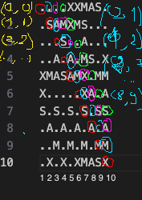
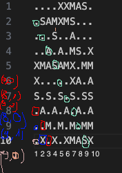
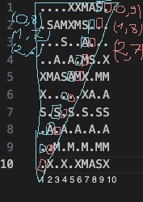
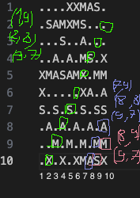

## Part 1 :star:
[part1.py](part1.py) <br><br>
Our input looks like this: <br>
```MMMSXXMASM
MSAMXMSMSA
AMXSXMAAMM
MSAMASMSMX
XMASAMXAMM
XXAMMXXAMA
SMSMSASXSS
SAXAMASAAA
MAMMMXMMMM
MXMXAXMASX
```
**Main problem to solve:** <br>
It's a word search game. Game where to win u need to find as many as possible words.<br>
In this problem set we need to find all **"XMAS"** words.<br><br>

To find all words we need to look in **8** possibilities.<br>
Words can be put: 
1. Vertically
2. Vertically backwards
3. Horizontally 
4. Horizontally backwards
5. Diagonal (left top corner to right down corner)
6. -||- backwards
7. Diagonal (right top corner to left down corner)
8. -||- backwards

## Solving

I cut everything in smaller pieces so I will know what's happening in my code. <br>
Every "direction" have own function. <br><br>

The main function that will be checking if the "XMAS" words are existing in line is called **search_for_XMAS** that will be getting array of the strings, where each string is treated as a line. <br>
I'm using regex to find all matching words.<br>
Iam also quickly reversing each line so also it will be looking for words that exists in backwards setup. 
```
def search_for_XMAS(lines: List[str]) -> None: 
    global result
    for line in lines:
        backward_line = line[::-1]
        result += len(re.findall(r"XMAS", line))
        result += len(re.findall(r"XMAS", backward_line))
```
<br>

Variable called **file** is the array that contains each line of the input. 


### 1. Vertical Check
To find all occurs of "XMAS" in vertical line.
We are simply doing for loop for each line. The rest is handled by our main function.

### 2. Horizontal Check 
We can treat our **file** variable as matrix. <br>
The best option for me was to [transpose](https://en.wikipedia.org/wiki/Transpose) the matrix to read it as vertical lines.<br>
Then we are doing same staff like in vertical check.

### 3. Diagonal check (left top corner to right down corner)
For me that was the hardest directions to check. <br>
We need to think about all indexes and how to create each line from diagonal layout. <br>
I will put some images to help you visualize the problem. <br><br>



### 4. Diagonal check (right top corner to left down corner)
Like in tag above to solve this direction we just need to find good indexes. <br>
Consider just going with debugger and find if the indexes match indexes one the matrix grid. <br>
Some images to visualize: <br><br>

